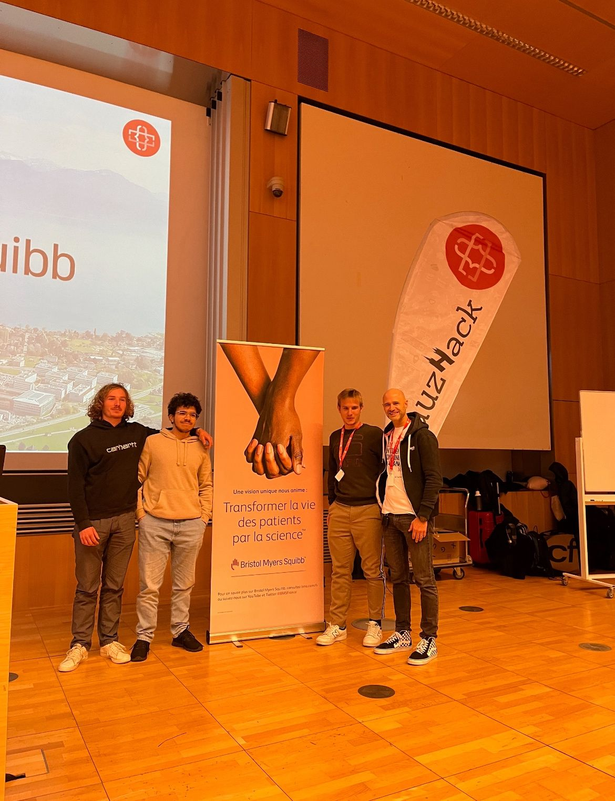

# 🧩 Lauzhack 2023 — EPFL Hackathon

## 🧠 Overview
This repository contains the codebase developed during **Lauzhack 2023** at EPFL, where our team won **1st place in the BMS Challenge**.  
Our project combines **machine learning**, **mobile development**, and **backend integration** to provide a complete healthcare-oriented solution.  

The system includes:
- A **Flutter-based web app** for real-time interaction and visualization.  
- A **Python deep learning pipeline** (adapted from the `ecg_ptbxl_benchmarking` repository) for ECG signal analysis.  
- A **Django REST API** connecting the machine learning model to the front-end and managing data flow.  

  

---

## ⚙️ Technical Details

| Category | Details |
|-----------|----------|
| **Languages** | Python, Dart, JavaScript |
| **Frameworks / Libraries** | `Flutter`, `Django`, `NumPy`, `Pandas`, `PyTorch`, `scikit-learn`, `Matplotlib` |
| **Techniques** | ECG signal classification, deep learning (CNN), REST API integration, cross-platform front-end design |
| **Architecture** | Client–Server system — Flutter app ↔ Django API ↔ Python ML engine |
| **Environment** | Ubuntu 22.04 / macOS, Python 3.10, Flutter SDK, VS Code |
| **Features** | End-to-end pipeline for ECG analysis, and visualization |

---
